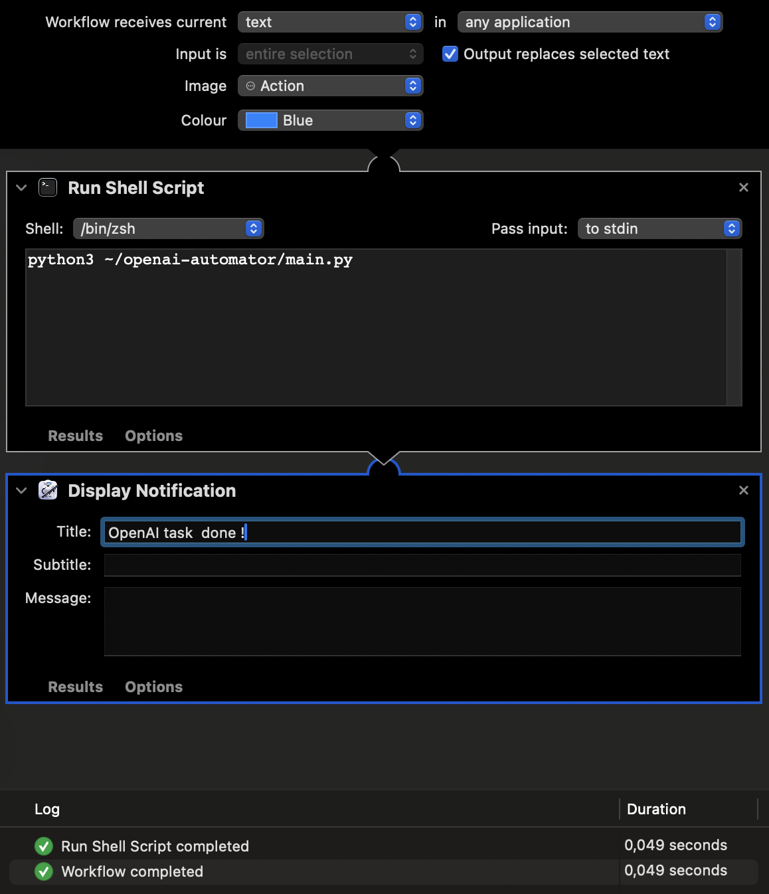

# macOS OpenAI Automator 🤖

- A script for Mac Automator that allows you to perform spell checks or other text-related tasks within any application on Mac OS. 
- Availible prompts:
    - spellcheck: English spellchecker (default)
    - coding: Code generation
    - genz: Translate English to GenZ
    - enfr: Translate English to French.
- You can add your own prompt to the prompts folder.

## Install:

- Ensure that you have Python 3 installed.
- Check out this project using Git in your home directory.
- Rename .env.example to .env and add your OpenAI API key.
- Add OpenAI.workflow to Automator.
- Recommended service Keyboard Shortcut: Shift + Ctrl + Z
- The project contains three prompts. The default prompt is spellcheck 
- For prompts other than the default, begin the selected text with the name of the prompt in square brackets.

## Example: 
- Select the following text inside an editable box: _[genz] Hello world, how are you ?_
- Press the shortcut keys.
- The text will be replaced with: _Heyyy world, wassup? How ya vibin'? 😎🌍🤙_

